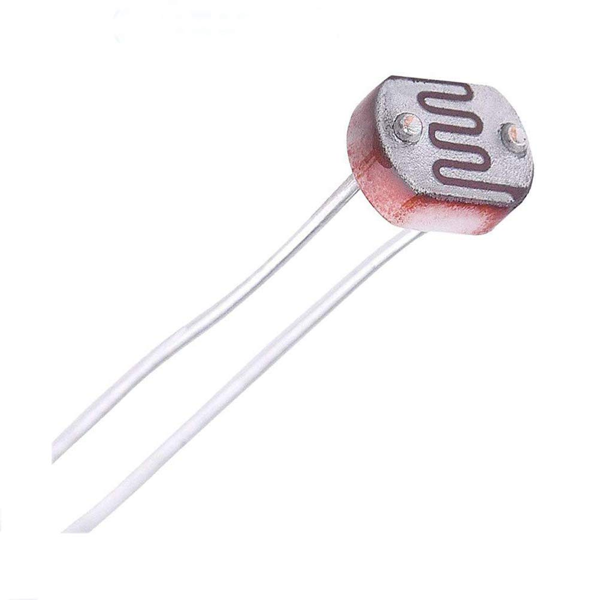
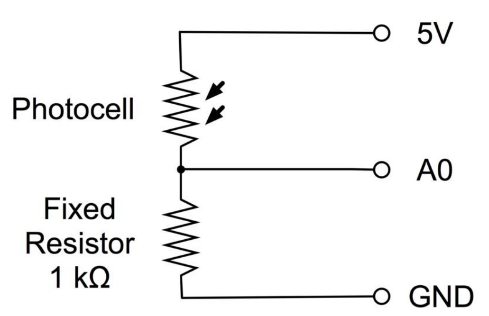
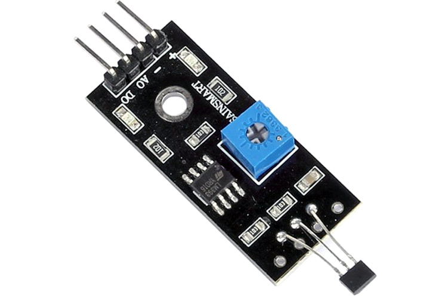
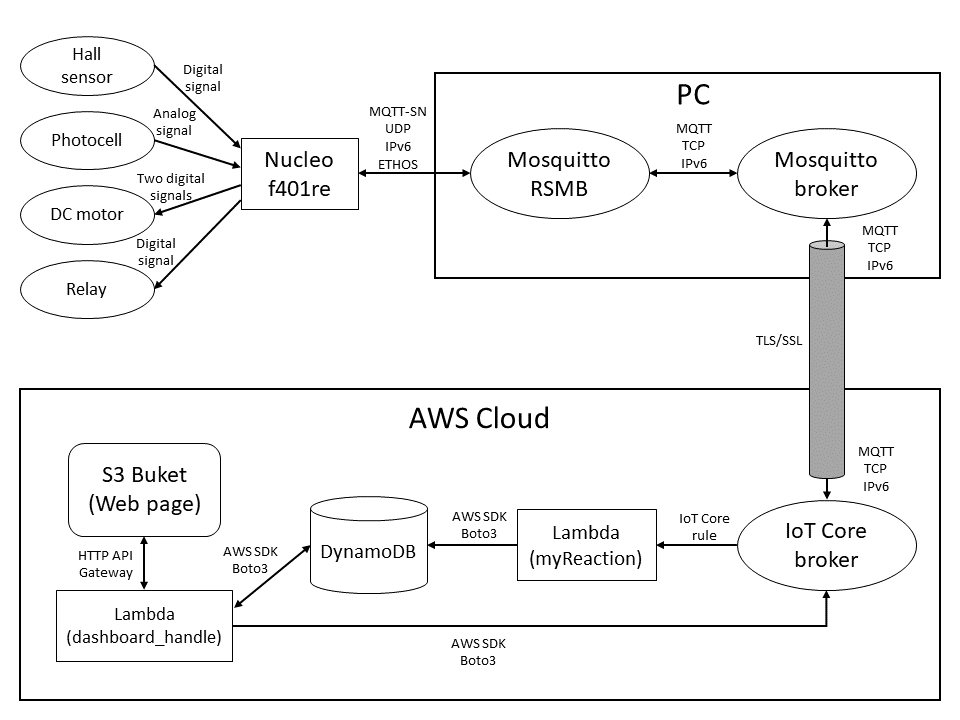
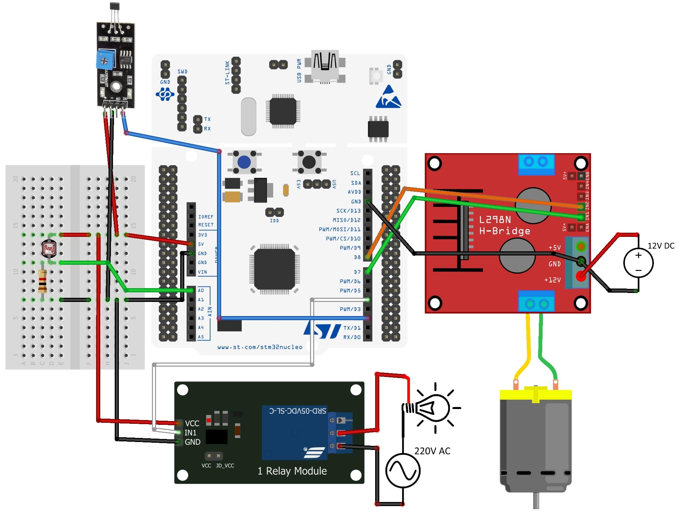

# IoT course: First individual assignment

## What is the problem and why do you need IoT?

This is a prototype of an IoT system to be used in university's rooms. By using a photocell and an Hall sensor is possible to detect in which light condition and at what hours the projector is usually used or not. This can be done with a periodical sampling of the sensors state.

From this data a model can be derived and used to automatically control the room lights with a relay and the windows curtains with a DC motor so to automatically have the ideal light condition in each situation.

In this prototype to control the actuators is used a simple logic that can be summarized with these two rules:
- If the projector is open **AND** there is too much light **AND** is lecture time **=>** (if lights are on **=>** switch lights off) **ELSE** (if lights are off **AND** curtains are open **=>** close the curtains)
- If the projector is closed **AND** there is low light **AND** is lecture time **=>** (if curtains are closed **=>** open curtains) **ELSE** (if curtains are open **AND** lights are off **=>** switch on the lights)

## What data are collected and by which sensors?

### Light sensor

The light condition is measured based on the electric resistance of a photocell (GL5528) placed in the room. Using the circuit below is possible to measure the photocell electrical resistance from an analog pin of the STM32 board.

 

To be more tolerant to noise each measurement is computed as the average of 10 voltage readings made with a 0.5s delay. Each raw measurement measurement uses a 12 bit ADC, so the signal will be between 0 and 4095, this values are then mapped in a 10 to 100 lux scale. The ten analog measurements are repeated every 10s.

### Hall sensor

The Hall sensor (A3144) is already mounted on a simple sensor module which provides a digital signal LOW when a magnetic field is detected, HIGH otherwise. With a 10K potentiometer on the board is possible to regulate the sensibility based on the type of magnet used so to trigger the sensor at the desired distance (around 2cm in this case).

This sensor is used to detect if a magnet placed on the end of the projector screen is near the sensor placed on the wall. In this way when the screen is rolled up (and so the projector is switched off) the Hall sensor detects the magnetic field of the magnet, while it doesn't when the screen is unrolled. The digital value given by this sensor is sampled after the light measurement (every 10s).

## What are the connected components, the protocols to connect them and the overall IoT architecture?

The network uses Mosquitto RSMB to communicate via ETHOS with the board, a Mosquitto broker with authentication to communicate with IoT Core. From IoT Core a lambda function is used to implement the collective intelligence and store the data in a DynamoDB table. A web page hosted on an S3 bucket is realizes a simple user interface. This page periodically calls an API gateway to get the data from the DynamoDB and send actuation command to the board.
The overall network is represented in this scheme.

## Hands-on walkthrough

To use this system start by cloning this repository

    git clone https://github.com/lodauria/assignment1.git

Then make sure to have downloaded [RIOTS-OS](https://github.com/RIOT-OS/RIOT), [Mosquitto RSMB](https://github.com/eclipse/mosquitto.rsmb), [Mosquitto broker]() and to have an active AWS account.

### Makefile adjustments
Make sure to modify `Makefile` with the correct path of the RIOT folder and the IPv6 prefix length with the best option for your PC network configuration.

### Compile and upload software
In the project directory compile and upload the program on your STM32 nucleo board with the following command

    make flash term

Don't forget to type also the sudo password that will be required after executing this command.

### Connect the electronic components
Connect the 2 sensors, the relay and the motor as shown below.

### Mosquitto and AWS setup
Read the dedicated guides to set up AWS cloud components: [Mosquitto setup](./mosquitto/) and [AWS setup](./aws/).