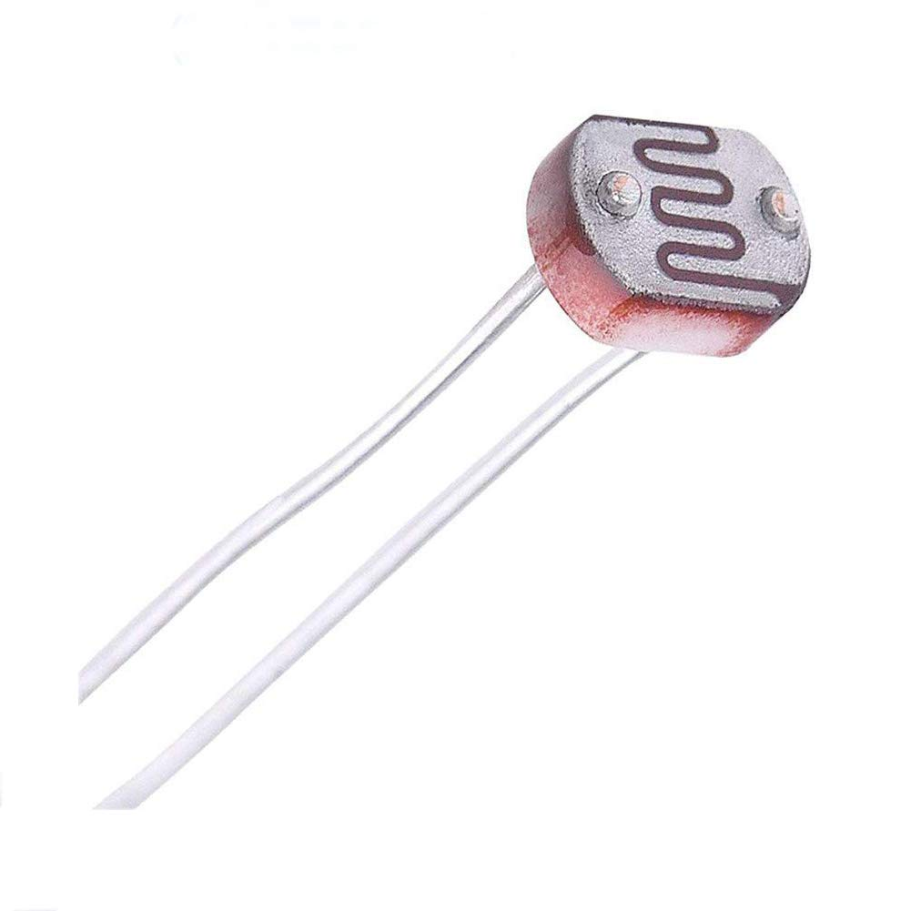

# First individual assignment

## System logic description

To monitor the room condition we will consider the data collected from a light sensor and an Hall sensor placed on the projector screen. From this data, a model can be derived and used to automatically control the room lights with a relay and the windows curtains with a DC motor so to automatically have the ideal light condition in each situation.

In this prototype the actuation logic is simplified by these two rules:
- If the projector is open **AND** there is too much light **AND** is lecture time **=>** (if lights are on **=>** switch lights off) **ELSE** (if lights are off **AND** curtains are open **=>** close the curtains)
- If the projector is closed **AND** there is low light **AND** is lecture time **=>** (if curtains are closed **=>** open curtains) **ELSE** (if curtains are open **AND** lights are off **=>** switch on the lights).

## Sensors description

### Light sensor

The light condition is measured based on the electric resistance of a photocell (GL5528) placed in the room. Using the circuit below is possible to measure the photocell electrical resistance from an analog pin of an MCU board.

 

Each raw measurement uses a 12 bit ADC, so the signal will be between 0 and 4095, this values are then mapped in a 10 to 100 lux scale. The analog measurement is repeated every 10s.

### Hall sensor

The Hall sensor (A3144) is already mounted on a simple sensor module which provides a digital signal LOW when a magnetic field is detected, HIGH otherwise. With a 10K potentiometer on the board is possible to regulate the sensibility based on the type of magnet used so to trigger the sensor at the desired distance (around 2cm in this case).

This sensor is used to detect if a magnet placed on the end of the projector screen is near the sensor placed on the wall. In this way when the screen is rolled up (and so the projector is switched off) the Hall sensor detects the magnetic field of the magnet, while it doesn't when the screen is unrolled. The digital value given by this sensor is sampled after the light measurement (every 10s).

## Network architecture

In the configuration developed for the first assignment the network uses Mosquitto RSMB to communicate via ETHOS with the board and a Mosquitto broker with authentication to communicate with IoT Core. In the AWS Cloud IoT Core calls a lambda function when new data are received. This function is used to implement the collective intelligence and to store the new data in a DynamoDB table. A web page hosted on an S3 bucket realizes a simple user interface. This page periodically calls an API gateway to get the data from the DynamoDB and, if requested, sends actuation command to the IoT Core MQTT broker. The overall network is represented in this scheme.

## Other considerations

## Hands-on walkthrough

For the first assignment the interactions with the environment are mediated only by a single STM32 Nucleo F401RE board connected to internet through a PC. Make sure to have installed [RIOTS-OS](https://github.com/RIOT-OS/RIOT), [Mosquitto RSMB](https://github.com/eclipse/mosquitto.rsmb), [Mosquitto broker](https://github.com/eclipse/mosquitto) and to have an active [AWS](https://www.awseducate.com/signin/SiteLogin?ec=302&startURL=%2Fstudent%2Fs%2F) account.

### STM32 Nucleo F401RE board setup

#### Makefile adjustments

Make sure to modify `Makefile` with the correct path of the RIOT folder and the IPv6 prefix with the best option for your PC network configuration.

#### Compile and upload software

In the project directory compile and upload the program on your STM32 Nucleo FE401RE board with the following command

    make flash term

Don't forget to type also the super user password that will be required after executing this command.

#### Connect the electronic components

Connect the 2 sensors, the relay and the motor as shown below.

### Mosquitto and AWS setup

Refer to the dedicated folders to set up the other components:
- [Mosquitto setup](mosquitto/)
- [AWS setup](aws/)
