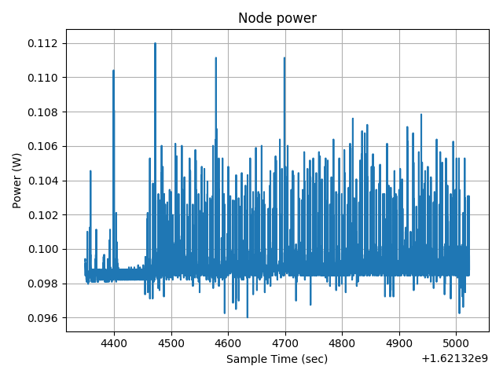
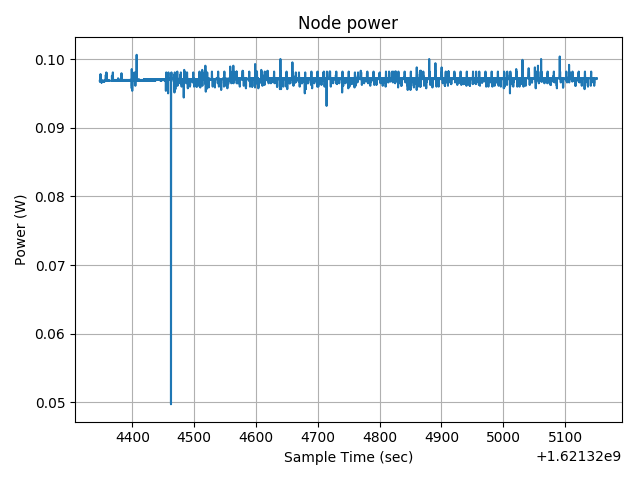
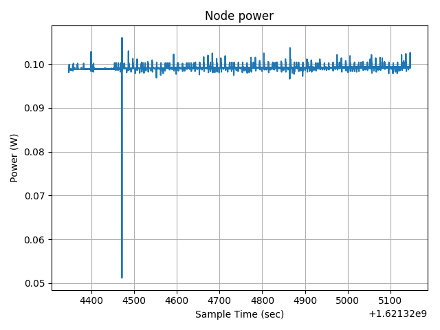

# Second individual assignment

For the second assignment the components developed for the [first assignment](first_assignment.md) have been adapted to extend the system with additional wireless sensor nodes. In addition for this assignment the new sensor node performances have been evaluated.

## Network architecture

In the configuration developed for the second assignment the network is composed of multiple [M3 nodes](https://www.iot-lab.info/docs/boards/iot-lab-m3/) of the [FIT IoT-Lab](https://www.iot-lab.info/). One of the nodes is used as border router to provide connection to Internet to the hole network. An additional [A8-M3 node](https://www.iot-lab.info/docs/boards/iot-lab-a8-m3/) is used to run the Mosquitto RSMB broker connected with the nodes and the bridged Mosquitto broker connected to IoT Core with the proper certificates. The IoT Core components are the same used in the first assignment. The local STM32 Nucleo board, with the code developed for the first assignment, can be used as additional sensor node by bridging the RSMB running on the PC with the Mosquitto broker of the A8-M3 node, which is reachable using its global IPv6 address. The overall architecture is shown in the picture below.

## Performance evaluation

### Power consumption

#### Border router

The power consumption of the border router is reported in the plot below.

It can be noticed that there are a lot of peaks based on the wireless network activity and interference. This plot was obtained while using 5 sensor nodes, but the power consumption increases with the number of nodes.

#### Sensor node

The power consumption of a sensor node is less than that of the border router and depends on the distance from the latter. The consumption anyway is around 0.1 W also in this case. This is the plot of a node that is quite close to the border router (around 3m).

While this is the power consumption of a node farther from the border router (around 6m).

### Network evaluation

#### Wireless network

The 6LoWPAN network present on the M3 nodes uses a 2.4GHz frequency with a maximum throughput of 256kbit/s and a maximum range of around 40m indoor. The RSSI measured with the `ping` command was around -50dBm maybe due to the interference with other experiments, anyway was good enough to receive the 90% of the sensor nodes packets, but this depends also on the collisions between the messages of each sensor node. A good synchronization between the sensor nodes could produce even better results.

#### Network latency

The latency from the sensor nodes to the border router is around 65ms, while the latency from a sensor node to the AWS cloud is around 0.4s. Since the application of this IoT system doesn't require a fast behavior the latency measured is satisfactory.

#### Network security

Network security was not the main focus of this assignment, in fact the wireless network can be accessed by any device near enough to the border router which can be connected to the RSMB broker to send and receive MQTT-S messages. Apart from that, the most problematic aspect of this implementation is the fact that the Mosquitto broker implemented on the A8-M3 node can be accessed by any device on the internet by using the IPv6 global address of that node. A simple solution to this problem could be to setup a firewall on the A8-M3 node that blocks all the connections except from the one coming from the local STM32 Nucleo board.

## Other considerations

## Hands-on walkthrough

For the second assignment the interaction with the environment is carried out by multiple M3 nodes of the FIT IoT-Lab. The overall wireless sensor network is connected to the Internet through an A8-M3 node. Make sure to have installed [RIOTS-OS](https://github.com/RIOT-OS/RIOT), [Mosquitto RSMB](https://github.com/eclipse/mosquitto.rsmb), [Mosquitto broker](https://github.com/eclipse/mosquitto) and to have active [AWS](https://www.awseducate.com/signin/SiteLogin?ec=302&startURL=%2Fstudent%2Fs%2F) and [FIT IOT-Lab](https://www.iot-lab.info/testbed/login?next=%2Fdashboard) accounts.

### Submit an IoT LAB experiment

Create a new experiment in Saclay with some M3 nodes (suggested number is 5) and an A8-M3 node. Make sure that their position allows a wireless connection.

### Setup A8-M3 node

To run the Mosquitto brokers on the A8-M3 node follow the instructions of the [dedicated folder](mosquitto). You will need the IPv6 global address of the A8-M3 node to setup the sensor nodes. You can use the command `ip -6 -o addr show eth0` from the A8-M3 node terminal.

### Setup a M3 border router node:

#### Makefile adjustments

Make sure to modify `Makefile` with the correct path of the RIOT folder. If needed you can also modify the `DEFUALT_CHANNEL` used by the 802.15.4 mesh network.

#### Compile and upload software

From the `border_router` folder compile the code for the ARM Cortex M3 board with the command

    make

Upload the compiled program to one of the M3 nodes of the experiment. Now start the border router from Saclay terminal with the following command:

    sudo ethos_uhcpd.py m3-10 tap4 2001:660:3207:04c9::1/64

Here the M3 node is assume to be the number 10, change this number based on the nodes assigned to your experiment. The number of the tap interface and the IP prefix can also be changed based on the availability of the resources on the Saclay terminal. After this command leave the terminal open.

### Setup the remaining M3 sensor nodes:

#### Makefile adjustments

Make sure to modify `Makefile` with the correct path of the RIOT folder. If needed you can also modify the `DEFUALT_CHANNEL` used by the 802.15.4 mesh network accordingly to the one chosen when compiling the bored router program.

#### Compile and upload software

From the `sensor_node` folder compile the code for each of the ARM Cortex M3 boards used as sensors with the command

    make NODE_ID=<XX> SERVER_ADDR=<A8-M3 node address>

where you have to make sure to use a different node ID numbers for each of the sensor nodes. Use numbers from 1 to 100. The server address is the global IPv6 address of the A8-M3 node used to run the Mosquitto RSMB broker.

Upload each compiled program to the M3 nodes of the experiment that have to be used as sensor nodes. If you want to access the shell of a sensor node use the following command from the FIT IoT-Lab terminal

    nc m3-XX 20000

### Setup STM32 Nucleo F401RE board

If you want to use a local STM32 Nucleo board as an additional sensor node check the code and the instructions contained in the [first assignment](first_assignment.md), the only change that has to be done is in the configuration of the local RSMB to which the board is connected. In particular inside the file `config.conf` the address of the outgoing bridge has to be substituted with the A8-M3 global address.

### Mosquitto and AWS setup

Refer to the dedicated folders to set up the other components:

- [Mosquitto setup](mosquitto/)
- [AWS setup](aws/)
