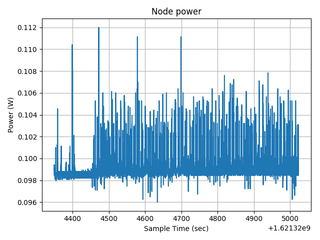
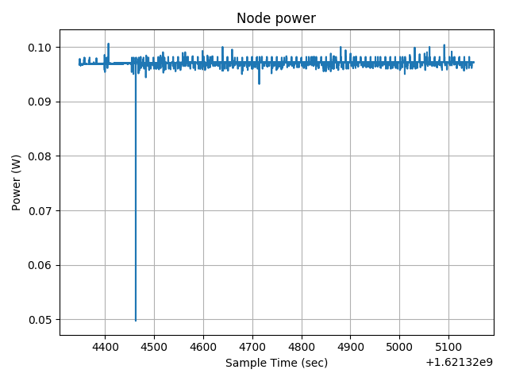
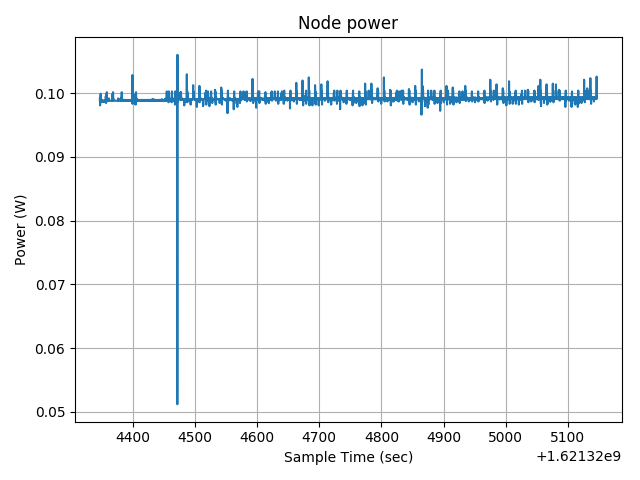

# Performance evaluation

In this document the performance of the overall wireless sensor network is evaluated by considering the following aspects.

## Power consumption

### Border router

The power consumption of the border router is reported in the plot below.

It can be noticed that there are a lot of peaks based on the wireless network activity and interference. This plot was obtained while using 5 sensor nodes, but the power consumption increases with the number of nodes.

### Sensor node

The power consumption of a sensor node is less than that of the border router and depends on the distance from the latter. The consumption anyway is around 0.1 W also in this case. This is the plot of a node that is quite close to the border router (around 3m).

While this is the power consumption of a node farther from the border router (around 6m).

## Network evaluation

### Wireless network

The 6LoWPAN network present on the M3 nodes uses a 2.4GHz frequency with a maximum throughput of 256kbit/s and a maximum range of around 40m indoor. The RSSI measured with the `ping` command was around -50dBm maybe due to the interference with other experiments, anyway was good enough to receive the 90% of the sensor nodes packets, but this depends also on the collisions between the messages of each sensor node. A good synchronization between the sensor nodes could produce even better results.

### Network latency

The latency from the sensor nodes to the border router is around 65ms, while the latency from a sensor node to the AWS cloud is around 0.4s. Since the application of this IoT system doesn't require a fast behavior the latency measured is satisfactory.

### Network security

Network security was not the main focus of this assignment, in fact the wireless network can be accessed by any device near enough to the border router which can be connected to the RSMB broker to send and receive MQTT-S messages. Apart from that, the most problematic aspect of this implementation is the fact that the Mosquitto broker implemented on the A8-M3 node can be accessed by any device on the internet by using the IPv6 global address of that node. A simple solution to this problem could be to setup a firewall on the A8-M3 node that blocks all the connections except from the one coming from the local STM32 Nucleo board.